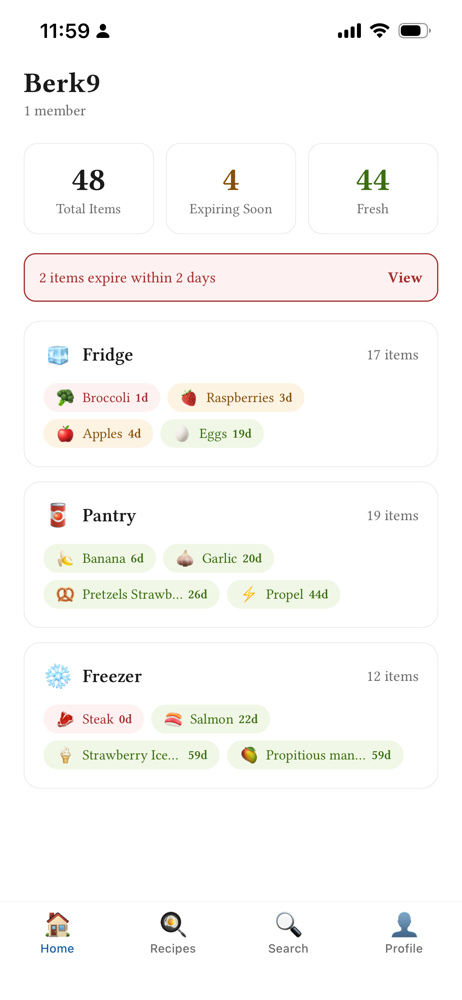
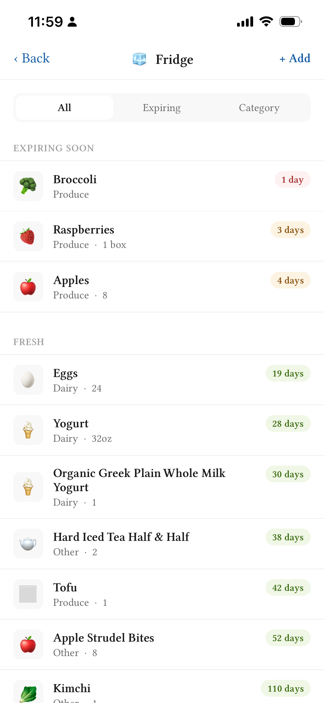
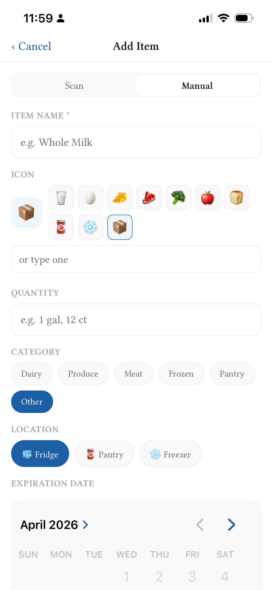
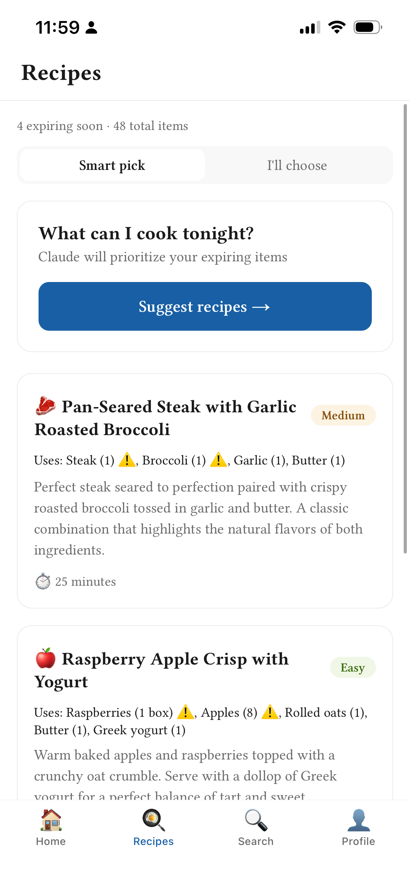
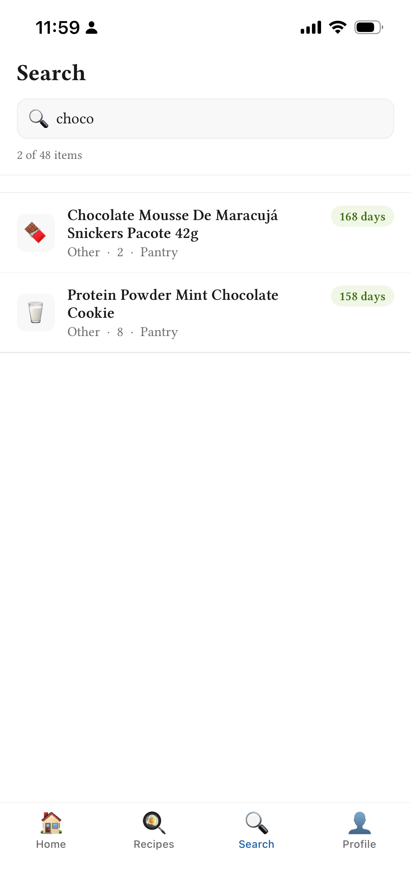
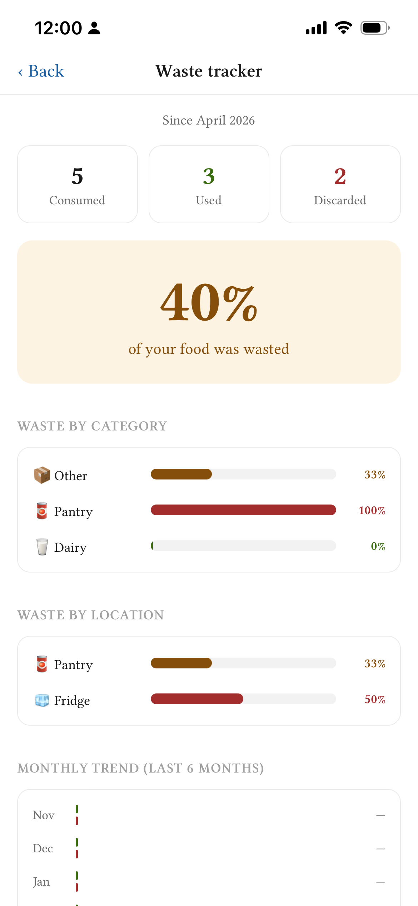

# TupperAware 🥡

A household food inventory and expiration tracking iOS app built with React Native + Expo. Know what's in your fridge, pantry, and freezer — and get notified before things expire.

> Built as an empirical case study in LLM-driven software development for a Financial Economics capstone project. The app was rebuilt solo using Claude Code, compared against a prior version built by a team of 4 developers over 48 hours at a hackathon.

---

## Screenshots

<table>
  <tr>
    <td align="center"><br/><sub>Home</sub></td>
    <td align="center"><br/><sub>Location View</sub></td>
    <td align="center"><br/><sub>Add Item</sub></td>
  </tr>
  <tr>
    <td align="center"><br/><sub>Recipe Recommender</sub></td>
    <td align="center"><br/><sub>Search</sub></td>
    <td align="center"><br/><sub>Waste Analytics</sub></td>
  </tr>
</table>

---

## Features

- **Household inventory** — organize food across multiple locations (fridge, pantry, freezer, or custom)
- **Expiry tracking** — color-coded freshness status (red / amber / green) with push notification alerts
- **Barcode scanning** — scan grocery items to auto-populate name and category via Open Food Facts API
- **Smart expiry defaults** — auto-suggests expiration dates based on item name and category
- **Recipe suggestions** — AI-powered recipe ideas prioritizing your expiring items, powered by Claude
- **Waste analytics** — track used vs. discarded items over time with category and location breakdowns
- **Household sharing** — multiple users can share a household inventory
- **Partial use tracking** — mark items as partially used to keep inventory accurate

---

## Tech Stack

| Layer              | Technology                          |
| ------------------ | ----------------------------------- |
| Mobile framework   | React Native + Expo (TypeScript)    |
| Backend / database | Supabase (Postgres + Auth)          |
| Navigation         | Expo Router (file-based)            |
| Camera / scanning  | expo-camera + expo-barcode-scanner  |
| Notifications      | expo-notifications                  |
| Recipe AI          | Anthropic Claude API                |
| Date utilities     | date-fns                            |
| Font               | Libertinus (via expo-font)          |
| Testing            | Jest + React Native Testing Library |

---

## Prerequisites

Before you begin, make sure you have the following installed and set up:

- **Node.js** v20 or higher (`node --version` to check)
- **npm** v9 or higher
- **nvm** (recommended) — for Node version management
- **Expo Go** app installed on your iPhone ([App Store](https://apps.apple.com/app/expo-go/id982107779))
- A **Supabase** account — [supabase.com](https://supabase.com) (free)
- An **Anthropic** API account — [console.anthropic.com](https://console.anthropic.com) (free credits available)

---

## Setup Instructions

### 1. Clone the repository

```bash
git clone https://github.com/az-120/tupperaware.git
cd tupperaware
```

### 2. Install the correct Node version

```bash
nvm use
```

If you don't have Node 20 installed:

```bash
nvm install 20
nvm use 20
```

### 3. Install dependencies

```bash
npm install
```

### 4. Set up environment variables

Copy the example env file and fill in your own credentials:

```bash
cp .env.example .env.local
```

Open `.env.local` and fill in the values (see [Environment Variables](#environment-variables) below for where to find each one).

### 5. Set up Supabase

1. Go to [supabase.com](https://supabase.com) and create a free account
2. Create a new project — name it `tupperaware`
3. Wait for the project to provision (~2 minutes)
4. Go to **SQL Editor** in the dashboard
5. Paste and run the full schema from [`supabase/schema.sql`](./supabase/schema.sql)
6. Verify the following tables were created under **Table Editor**:
   - `households`
   - `household_members`
   - `locations`
   - `items`
7. Go to **Authentication → Providers → Email** and disable **Confirm email** for easier development

### 6. Get your Supabase credentials

1. Go to **Settings → API** in your Supabase dashboard
2. Copy the **Project URL** → paste as `EXPO_PUBLIC_SUPABASE_URL`
3. Copy the **anon public** key → paste as `EXPO_PUBLIC_SUPABASE_ANON_KEY`
4. Do **not** use the `service_role` key

### 7. Get your Anthropic API key

1. Go to [console.anthropic.com](https://console.anthropic.com)
2. Create an account (separate from claude.ai)
3. Go to **API Keys → Create Key**
4. Paste the key as `EXPO_PUBLIC_ANTHROPIC_KEY` in `.env.local`
5. Add a small credit balance ($5 is more than enough for development)

> ⚠️ **Security note:** In a production app the Anthropic key should live behind a server-side proxy. For development and demo purposes it is included in the client bundle. Do not use a key with a large credit balance.

### 8. Run the app

```bash
npx expo start
```

Scan the QR code with your iPhone camera to open in Expo Go.

> **Note:** Make sure your iPhone and Mac are on the same WiFi network. If the QR code doesn't connect, try `npx expo start --tunnel` instead.

---

## Environment Variables

Create a `.env.local` file in the project root with the following variables:

```bash
# Supabase — get from Settings → API in your Supabase dashboard
EXPO_PUBLIC_SUPABASE_URL=https://xxxxxxxxxxxx.supabase.co
EXPO_PUBLIC_SUPABASE_ANON_KEY=eyJhbGciOiJIUzI1NiIsInR5cCI6IkpXVCJ9...

# Anthropic — get from console.anthropic.com
EXPO_PUBLIC_ANTHROPIC_KEY=sk-ant-...
```

See `.env.example` for the variable names without values.

---

## Database Setup

The full database schema is in [`supabase/schema.sql`](./supabase/schema.sql). Run it in the Supabase SQL Editor to create all tables.

### Schema overview

```
households
  └── household_members (users ↔ households)
  └── locations (fridge, pantry, freezer, etc.)
        └── items (food items with expiry tracking)
```

### Tables

| Table               | Description                                                   |
| ------------------- | ------------------------------------------------------------- |
| `households`        | Top-level household entity                                    |
| `household_members` | Junction table linking users to households with roles         |
| `locations`         | Named storage locations within a household                    |
| `items`             | Food items with name, category, quantity, expiry date, status |

> **Note:** Row Level Security (RLS) is currently disabled on all tables for development simplicity. Re-enabling RLS with proper JWT configuration is recommended before any production deployment.

---

## Running Tests

```bash
# Run all tests
npm test

# Run with coverage
npm test -- --coverage

# Run a specific test file
npm test -- __tests__/analytics.test.ts
```

### Test structure

```
__tests__/
├── fixtures.ts              # Shared canonical test dataset
├── analytics.test.ts        # Waste analytics computation tests
├── anthropic.test.ts        # Recipe API utility tests
├── expiryDefaults.test.ts   # Expiry date suggestion tests
├── openFoodFacts.test.ts    # Barcode lookup tests
├── validation.test.ts       # Input validation tests
├── validators.test.ts       # Runtime data shape validators
├── useItems.test.ts         # Hook integration tests
├── useLocations.test.ts     # Hook integration tests
├── useHousehold.test.ts     # Hook integration tests
├── useAuth.test.ts          # Auth hook tests
├── addItemFlow.test.ts      # Add item screen integration tests
└── itemActions.test.ts      # Mark used/discard action tests
```

---

## Project Structure

```
tupperaware/
├── app/                        # Expo Router screens
│   ├── (tabs)/
│   │   ├── index.tsx           # Household home screen
│   │   ├── recipes.tsx         # AI recipe suggestions
│   │   ├── search.tsx          # Inventory search
│   │   └── profile.tsx         # Account + household settings
│   ├── location/
│   │   └── [id].tsx            # Location item list
│   ├── item/
│   │   ├── [id].tsx            # Item detail
│   │   ├── add.tsx             # Add item (scan + manual)
│   │   └── edit.tsx            # Edit item
│   ├── household/
│   │   ├── edit-name.tsx       # Edit household name
│   │   └── edit-locations.tsx  # Manage locations
│   ├── auth/
│   │   ├── sign-in.tsx
│   │   ├── create-account.tsx
│   │   ├── create-household.tsx
│   │   └── forgot-password.tsx
│   ├── analytics.tsx           # Waste tracking analytics
│   ├── expiring.tsx            # Expiring items view
│   └── _layout.tsx             # Root layout + auth gate
├── components/
│   ├── ItemRow.tsx
│   ├── LocationCard.tsx
│   ├── ExpiryPill.tsx
│   ├── StatCard.tsx
│   ├── BarcodeScanner.tsx
│   └── SelectableItemRow.tsx
├── hooks/
│   ├── useAuth.ts
│   ├── useHousehold.ts
│   ├── useLocations.ts
│   ├── useItems.ts
│   └── useNotifications.ts
├── lib/
│   ├── supabase.ts             # Supabase client
│   ├── anthropic.ts            # Recipe suggestion API
│   ├── openFoodFacts.ts        # Barcode lookup
│   ├── notifications.ts        # Push notification scheduling
│   ├── expiryDefaults.ts       # Expiry date suggestions
│   ├── validation.ts           # Input validation functions
│   ├── analytics.ts            # Waste analytics computations
│   └── validators.ts           # Runtime data shape validators
├── constants/
│   ├── colors.ts
│   ├── typography.ts
│   ├── spacing.ts
│   └── globalStyles.ts
├── types/
│   └── index.ts                # TypeScript types
├── supabase/
│   └── schema.sql              # Full database schema
├── __tests__/                  # Test files
├── .env.example                # Environment variable template
├── .env.local                  # Your local credentials (not committed)
├── .nvmrc                      # Node version pin
├── .npmrc                      # npm configuration
├── CLAUDE.md                   # LLM development specification
├── app.json                    # Expo configuration
└── package.json
```

---

## Known Limitations

- **Push notifications** require a real device build (EAS Build + Apple Developer account). Notification scheduling works but delivery in the background cannot be fully tested via Expo Go.
- **Row Level Security (RLS)** may affect new household creationg due to a JWT configuration issue with the Expo React Native client.
- **Anthropic API key** is included in the client bundle. A production deployment should proxy API calls through a serverless backend to protect the key.
- **Single household per user** — the data model supports multiple households but the UI currently assumes one household per user. Multi-household switching is scoped for a future release.
- **No account deletion** — account deletion requires a server-side Supabase admin API call and is scoped for a future release.
- **App Store distribution** — the app has not been submitted to the App Store. Distribution is via Expo Go for development purposes.

---

## Development Notes

This project uses a `CLAUDE.md` file in the repository root as a persistent specification for Claude Code (the AI coding agent used to build this app). It contains the full data model, screen architecture, coding conventions, and current task. If you are continuing development with Claude Code, update the `## Current task` section before each session.

### Key conventions

- All Supabase data fetching uses raw `fetch()` with explicit auth headers rather than the Supabase JS client, due to session token passing issues with the React Native client
- All validation logic lives in `lib/validation.ts` as pure functions
- All analytics computation lives in `lib/analytics.ts` as pure functions
- Use `npx expo install` for any new Expo packages, not `npm install`
- Run `npx expo-doctor` after any dependency changes

---

## Future Work

- Smoother registration + email authentication workflow with supabase
- See if RLS still prevents household insertion
- Own and manage multiple households
- Collaborate with other users, invite to household
- Receipt scanning for quick item addition
- Offline support, show cached data
- Backend proxy to prevent API key potential extraction
- True item decrement feature, cleanup from db
- Delete account/data feature
- More cohesive categories/custom ones
- Possible scanning improvements, ometimes it’ll populate but then clear it and say unknown scan
- Better prepopulation of expiration dates, more specific saved known expiration dates
- Emoji icon per item just one char/default emoji
- Annoying thing is adding all at once, how to manage?
- If you type too fast it gets messed up in the add items bar, maybe elsewhere too

---

## Acknowledgements

- [Open Food Facts](https://world.openfoodfacts.org) — free barcode product database
- [Anthropic Claude](https://anthropic.com) — recipe suggestion AI
- [Supabase](https://supabase.com) — backend and authentication
- [Expo](https://expo.dev) — React Native development platform

---

## License

MIT
